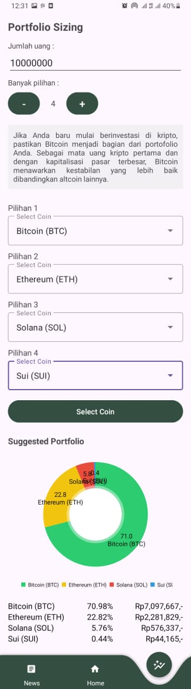

<h1 align="center">
  </img>
<br>
ZENVEST
</h1>

# Profile

### Team ID : C242-PS543

### Members

* M009B4KX1176 - [Diva Maharani Adila](https://github.com/divaadila)
* M001B4KY1408 - [Farhan Lado Anggaraksa Mascahyanto](https://github.com/FarhanLado)
* M319B4KY1553 - [Frederick](https://github.com/Frederickyzw)
* C278B4KY2339 - [M Faiz Hidayatullah N Junus](https://github.com/faizhidayatullah)
* C206B4KY2610 - [Muh. Fadjriano Aprilindo T.](https://github.com/fajritaridala)
* A009B4KY1028 - [Defarhan Nugraha Fadhali](https://github.com/deFare00)

### Roles/personnel

* Machine Learning (M009B4KX1176 - Diva Maharani Adila, M001B4KY1408 - Farhan Lado Anggaraksa Mascahyanto, M319B4KY1553 - Frederick)
* UI/UX & Android Development (A009B4KY1028 - Defarhan Nugraha Fadhali)
* Cloud Computing (C278B4KY2339 - M Faiz Hidayatullah N Junus, C206B4KY2610 - Muh. Fadjriano Aprilindo T.)

# AUDI
This project is our final project for Google Bangkit Academy 2024 Batch 2.

**Backgrounder:**

Investing in Indonesia is increasingly accessible, but a gap remains between financial literacy (65.43%) and financial inclusion (75.02%), highlighting the need for better understanding of financial risks. To address this issue, we developed a predictive app for young investors, using machine learning with TensorFlow to analyze historical market data and predict cryptocurrency trends. The app provides data-driven insights in an intuitive format to help investors make informed, lower-risk decisions. Our plan involved developing a Machine Learning model using LSTM to predict price movements, integrating a real-time API through Cloud Computing for up-to-date data, and building a mobile application with a user-friendly interface for seamless access to predictions and insights. As a result, the application has been successfully developed, empowering young investors to make informed decisions and contributing to the growth of Indonesia's financial ecosystem.

## Screenshots

<p align="center">
  
</p>

<p align="center">
  
  
</p>

<p align="center">
  
</p>


## Requirement
* Android Studio Koala
* Android Device or Android Emulator 
* Emulator / External Device
* USB Cable (to Connect Android Device to your Computer)

## Installation

#### 1. Clone this Project to your Computer
```bash
git clone https://github.com/deFare00/Zenvest.git
```

or you can use Android Studio 

File > New > Project from Version Control ...

#### 2. Open the Project in your Android Studio
Open Android Studio and select open an existing project.

#### 3. Run Project in Android Studio
Wait for Gradle Build to Finish and finally press the `Run > Run ‘app’`. Now the app has been installed in your phone / emulator. Make sure that you have configured your android device or emulator 

### the other way

#### 1. download file APK in https://drive.google.com/file/d/1adqySSw-xXFtlJL8rLsAjVMiR_lIvWSj/view?usp=sharing
### 2. install that file in your mobile phone

## Thank You :)
